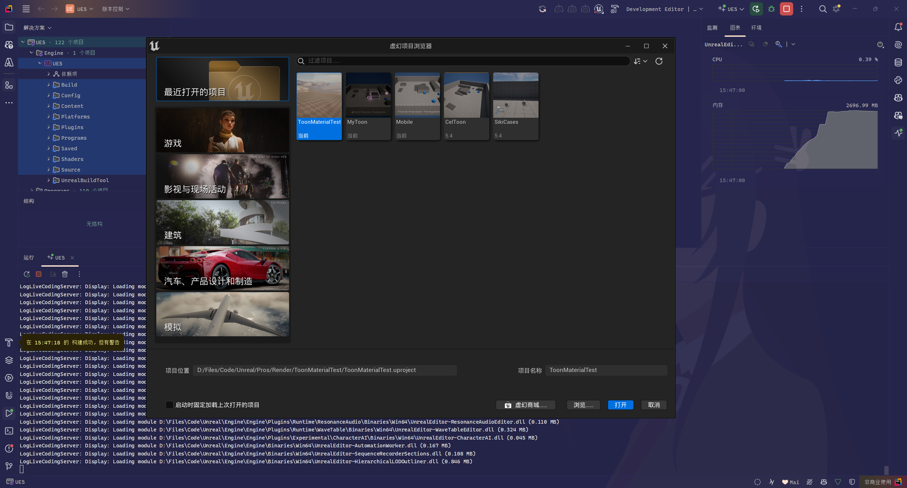
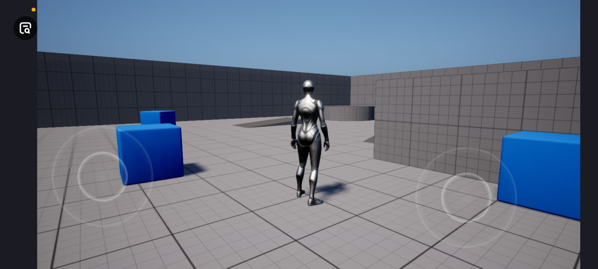
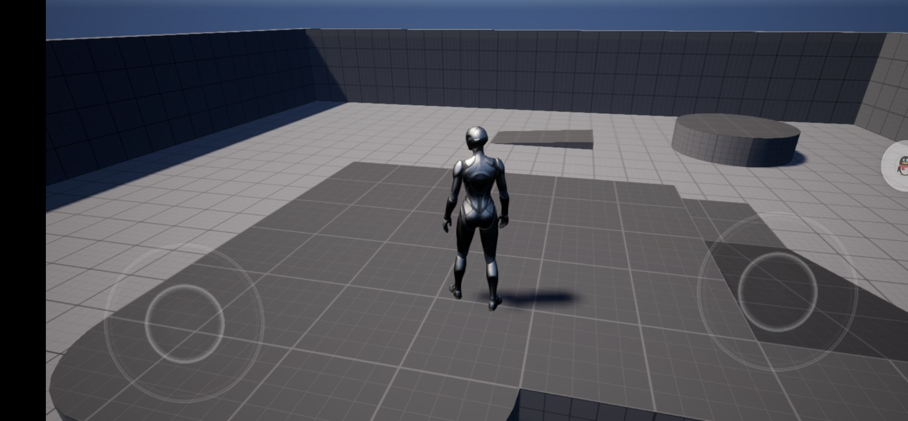
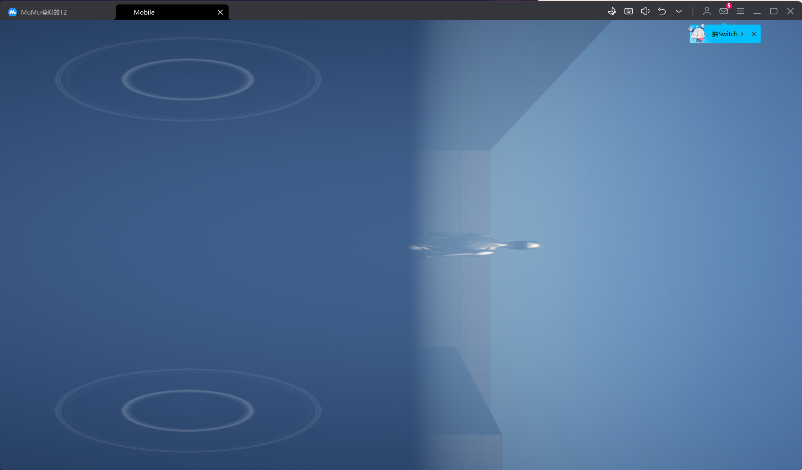

# 任务1
1. 源码编译UE5，新建一个C++工程，进行简单场景编辑和工程设置 
2. 编译并构建安装包，确保能够用来将游戏工程安装到手机正常运行
（若无Andorid手机可构建桌面版本）

# 结果
1. 源码编译 UE5.1
   使用Rider构建并编译运行，如下图。

2. 发布Android版本
    分别尝试在真机和模拟机上部署。\
    真机尝试了小米和华为，模拟机为MUMU。测试如下三图所示。
    
    
    